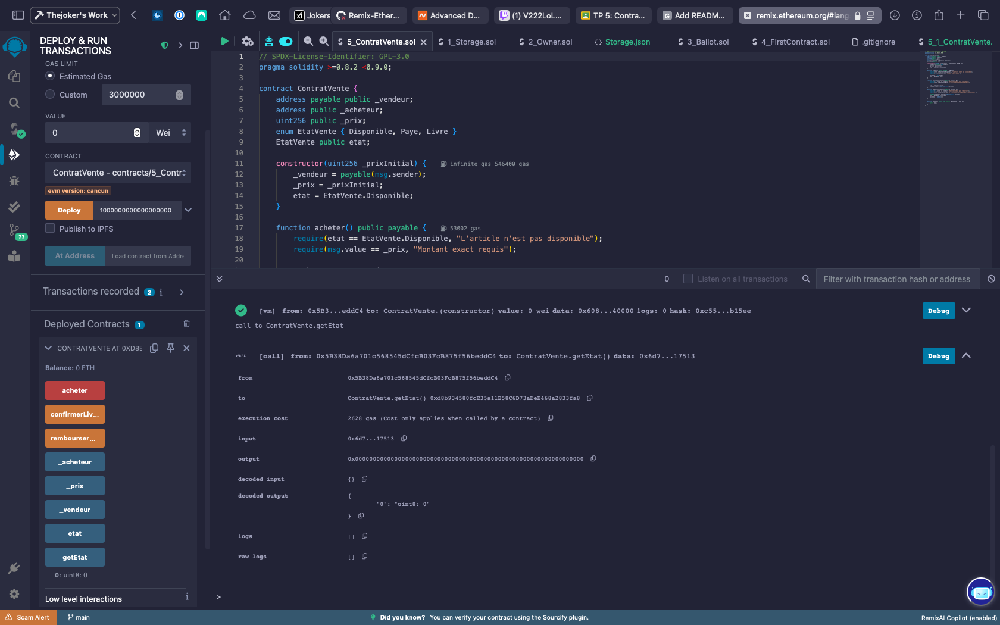

# Remix Default Workspace

## Overview

The Remix default workspace is present when:

- Remix loads for the very first time
- A new workspace is created with the 'Default' template
- There are no files existing in the File Explorer

This workspace contains three directories:

1. **contracts**: Holds three contracts with increasing levels of complexity.
2. **scripts**: Contains four TypeScript files to deploy a contract. Details are explained below.
3. **tests**: Contains one Solidity test file for the `Ballot` contract and one JavaScript test file for the `Storage` contract.

---

## Scripts

The `scripts` folder contains four TypeScript files that help deploy the `Storage` contract using the `web3.js` and `ethers.js` libraries.

### Deployment Instructions

To deploy any other contract:

1. Update the contract name from `Storage` to the desired contract.
2. Provide constructor arguments in the files `deploy_with_ethers.ts` or `deploy_with_web3.ts`.

### Running Scripts

- Right-click on the file name in the File Explorer and click **Run**.
- Ensure the Solidity file is already compiled.
- The output from the script will appear in the Remix terminal.

---

## Testing

The `tests` folder includes:

- A Mocha-Chai unit test script for the `Storage` contract.

---

## Module Support in Remix

Remix supports limited modules for `require`/`import`. Supported modules include:

- `ethers`, `web3`, `swarmgw`, `chai`, `multihashes`, `remix`, and `hardhat` (only for `hardhat.ethers` object/plugin).

For unsupported modules, an error like `<module_name> module require is not supported by Remix IDE` will be shown.

---

## Smart Contract Development - ContratVente

### Brief Description

The `ContratVente` Solidity smart contract models a simple sale where:

- A seller lists an item at a fixed price.
- A buyer purchases the item with Ether.
- The seller confirms delivery to release funds.

### Key Features

- **State Variables**:
  - `vendeur`: Payable address of the seller.
  - `acheteur`: Address of the buyer.
  - `prix`: Fixed price of the item in Wei.
  - `etat`: Enum representing the sale state (`Disponible`, `Paye`, `Livre`).

- **Functions**:
  - `acheter()`: Allows a buyer to purchase the item by sending the exact amount of Ether.
  - `confirmerLivraison()`: Called by the seller to confirm delivery and release funds.
  - `rembourserAcheteur()`: Allows refunding the buyer under specific conditions.
  - `getEtat()`: Returns the current state of the sale.

---

## Development and Testing

The contract is developed and tested using the Remix Ethereum IDE, which provides:

- Solidity compilation.
- Deployment to local or test networks.
- Function execution and testing.
- Transaction monitoring.

### Testing Results

The contract has been tested with various scenarios:

- Successful purchase with the exact payment amount.
- Failed purchase attempts with incorrect payment.
- State transitions through the sales process.
- Fund transfers between parties.

---

## Screenshots

### Contract Deployment and Testing

*Screenshot showing deployed contract with 1 ETH balance after a successful purchase transaction.*

*Screenshot demonstrating transaction testing, including a failed purchase attempt with incorrect payment amount.*
